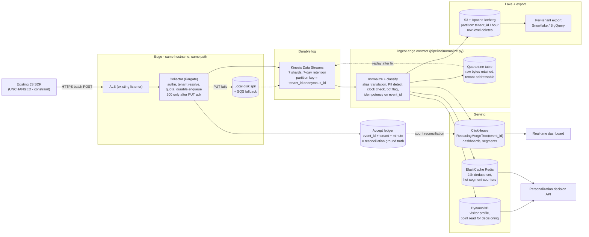
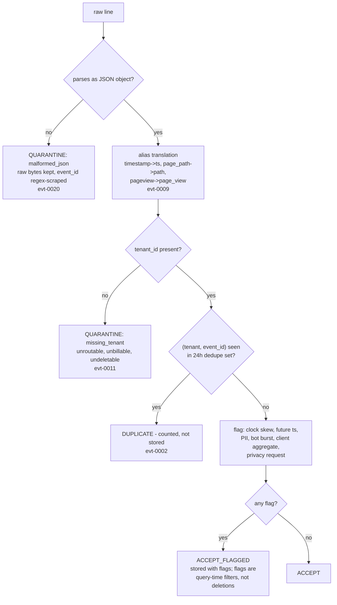
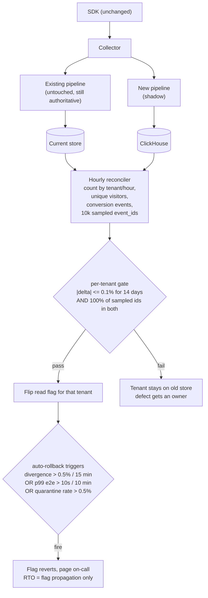

# Architecture Diagrams — Engineer 004

Companion to `ANSWER.md`. Diagrams do not count toward the 4-page limit.

## 1. Data flow, SDK to dashboard

## 2. Verdict machine — what happens to one line

Every input line leaves with exactly one verdict. There is no fifth outcome,
and there is no path that decrements a counter without writing a row. This is
enforced by `tests/test_normalize.py::TestNoSilentLoss`.

## 3. Migration — parallel run and rollback

Old pipeline keeps writing throughout. Rollback is a read-path flag flip, not a
data movement, which is why it can be automatic.

## 4. GDPR deletion blast radius (evt-0017)

The request names `u-1077`. The subject's other event, `evt-0006`, carries no
`user_id` — it is reachable only through `anon-77a`. A deletion job written
against `user_id` alone leaves it behind, and quarantine rows are the second
place deletion jobs forget to look.

```mermaid
flowchart LR
  REQ["evt-0017<br/>privacy_request delete_all_data<br/>GDPR, tenant t-088<br/>user_id u-1077, anon-77a"]
  REQ --> R1["1. Resolve subject keys<br/>u-1077 + every anonymous_id<br/>ever stitched to it"]
  R1 --> R2["2. Destroy per-subject data key<br/>(crypto-shred: PII columns<br/>become unreadable in every<br/>copy, including backups)"]
  R2 --> R3["3. Iceberg row-level delete<br/>by subject key"]
  R3 --> R4["4. Delete DynamoDB profile<br/>+ Redis counters"]
  R4 --> R5["5. Sweep QUARANTINE table<br/>evt-0011-class rows have<br/>no tenant: swept by<br/>anonymous_id and raw scan"]
  R5 --> R6["6. Emit tombstone to Kinesis<br/>so downstream warehouse<br/>exports replay the delete"]
  R6 --> R7["7. HUMAN sign-off before<br/>the destructive step runs<br/>+ signed completion record"]
```

